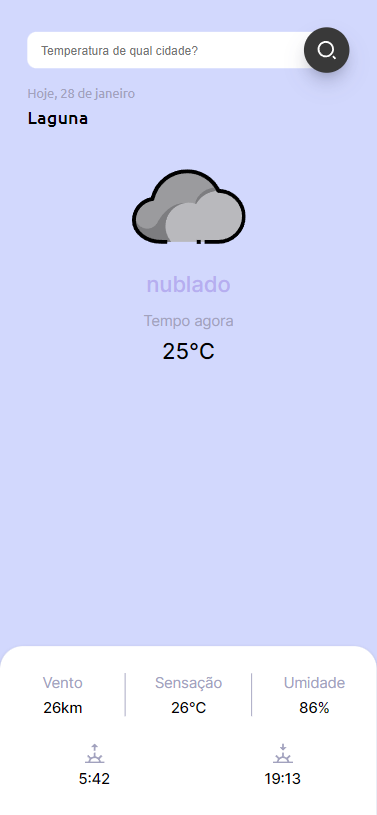

<h1 align="center"> Snapclima </h1>

Snapclima é uma aplicação que mostra o clima em determinado lugar, tanto pela sua localização atual ou então pela pesquisa de cidade.  

  <a href="#-tecnologias">Tecnologias</a>&nbsp;&nbsp;&nbsp;|&nbsp;&nbsp;&nbsp;
  <a href="#-projeto">Projeto</a>&nbsp;&nbsp;&nbsp;|&nbsp;&nbsp;&nbsp;

  

 

  

## 🚀 Tecnologias

Esse projeto foi desenvolvido com as seguintes tecnologias:

- HTML e CSS
- JavaScript
- Git e Github
- Figma

## 💻 Projeto

O Snaplclima é um app para ver o clima de determinado lugar, podendo colocar sua localização no inicio ou então apenas pesquisar a cidade desejada na barra de pesquisa.

- [Visite o projeto online](https://AlvaroAlano.github.io/Snapclima)
